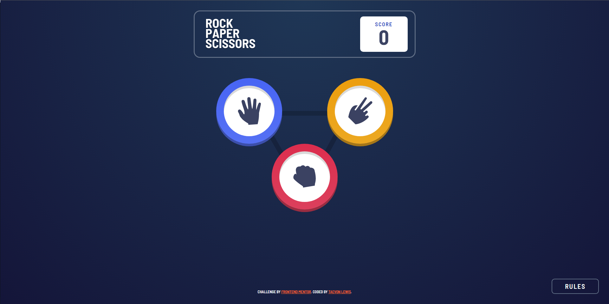

# Frontend Mentor - Rock, Paper, Scissors solution

This is a solution to the [Rock, Paper, Scissors challenge on Frontend Mentor](https://www.frontendmentor.io/challenges/rock-paper-scissors-game-pTgwgvgH). Frontend Mentor challenges help you improve your coding skills by building realistic projects.

## Table of contents

- [Overview](#overview)
  - [The challenge](#the-challenge)
  - [Screenshot](#screenshot)
  - [Links](#links)
- [My process](#my-process)
  - [Built with](#built-with)
  - [What I learned](#what-i-learned)
  - [Continued development](#continued-development)
  - [Useful resources](#useful-resources)
- [Author](#author)
- [Acknowledgments](#acknowledgments)

**Note: Delete this note and update the table of contents based on what sections you keep.**

## Overview

### The challenge

Users should be able to:

- View the optimal layout for the game depending on their device's screen size
- Play Rock, Paper, Scissors against the computer
- Maintain the state of the score after refreshing the browser _(optional)_
- **Bonus**: Play Rock, Paper, Scissors, Lizard, Spock against the computer _(optional)_

### Screenshot



### Links

- Solution URL: [GitHub Repo](https://github.com/lewist13/ROCK-PAPER-SCISSCORS)
- Live Site URL: [Netlify Deployed Site](https://roshamboapp.netlify.app/)

## My process

### Built with

- Semantic HTML5 markup
- CSS custom properties
- CSS Grid
- Vanilla JavaScript

### A few HTML, CSS, and JS code snippets, respectively:

```html
<section class="results hidden">
  <h2 class="results__heading">you picked</h2>
  <h2 class="results__heading">the house picked</h2>
  <div class="results__result"></div>
  <div class="results__winner hidden">
    <h3 class="results__text"></h3>
    <button class="play-again">play again</button>
  </div>
  <div class="results__result"></div>
</section>
<button class="rules-btn" tabindex="1">rules</button>
<div class="modal">
  <div class="modal__container">
    <header class="modal__header">
      <h2 class="modal__heading">rules</h2>
      <button class="close-btn">
        
      </button>
    </header>
  </div>
</div>
```

```css
.choice {
  position: relative;
  width: 10rem;
  height: 10rem;
  background: #fff;
  border-radius: 50%;
  display: grid;
  place-items: center;
  box-shadow: inset 0 0.5rem var(--shadow-light);
}
.choice::before,
.choice::after {
  content: "";
  position: absolute;
  left: -15%;
  top: -15%;
  width: 130%;
  height: 130%;
  border-radius: 50%;
  z-index: -1;
}

.choice::after {
  opacity: 0;
  transition: opacity 0.4s ease;
}
.choice-btn:focus .choice::after {
  opacity: 1;
  box-shadow: 0 0 0 2rem #223351;
  z-index: -2;
}
```

```js
function displayResults(results) {
  resultDivs.forEach((resultDiv, idx) => {
    setTimeout(() => {
      resultDiv.innerHTML = `
        <div class="choice ${results[idx].name}">
          
        </div>
      `;
    }, idx * 1000);
  });
  gameDiv.classList.toggle("hidden");
  resultsDiv.classList.toggle("hidden");
}
```

### Continued development

**I want to create a 2-Player game and sure users can keep track of their score**

## Author

- LinkedIn - [TaeVon Lewis](https://www.linkedin.com/in/taevonlewis/)
- Frontend Mentor - [@lewist13](https://www.frontendmentor.io/profile/lewist13)
- Twitter - [@SE_TizzyMatic](https://twitter.com/SE_TizzyMatic)
